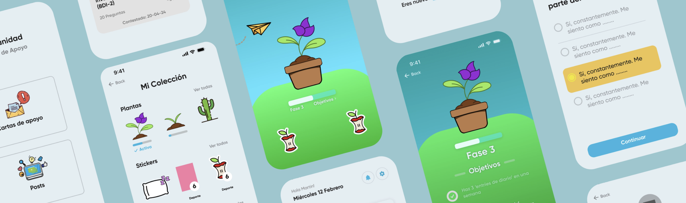
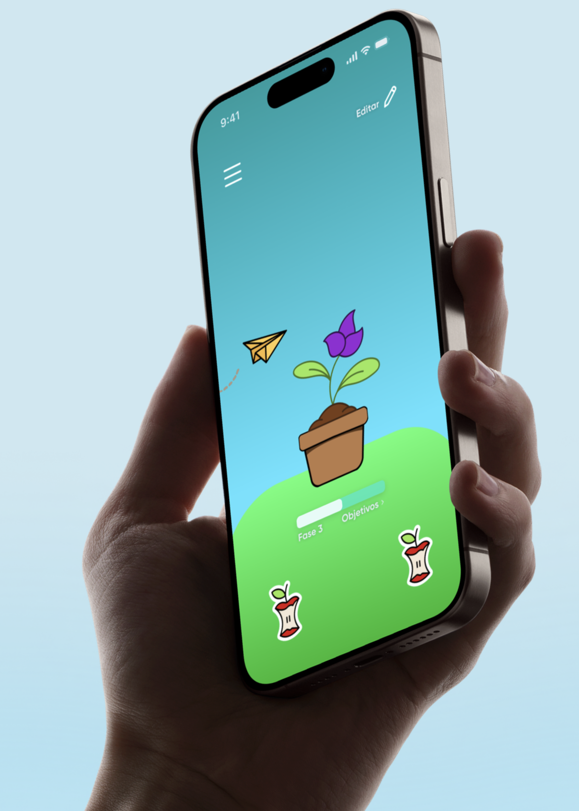
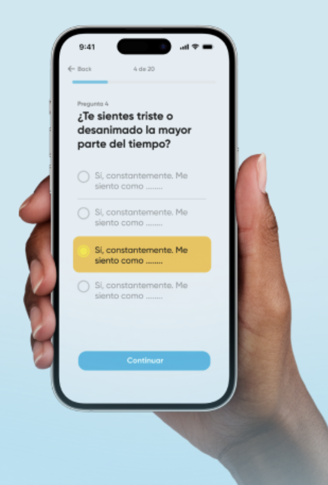
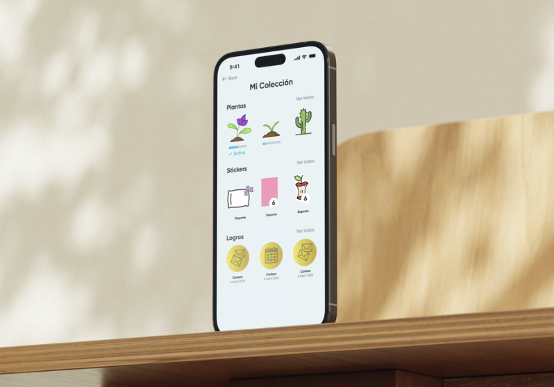
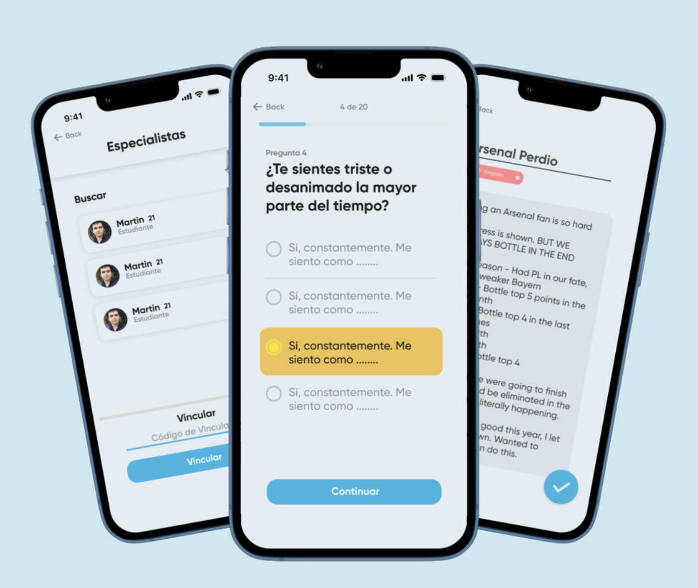
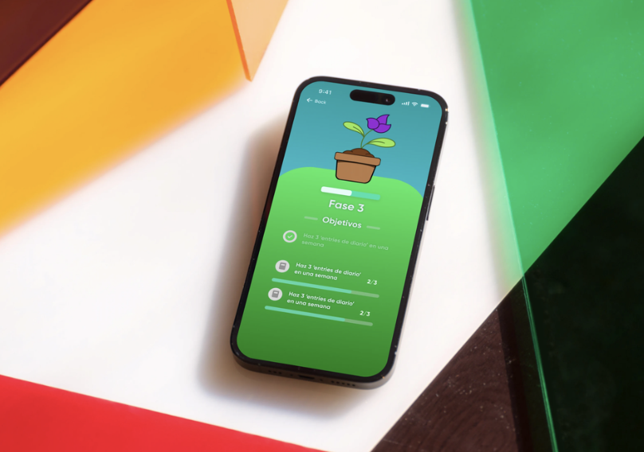
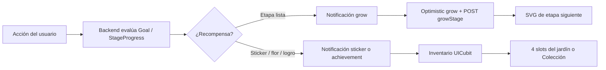
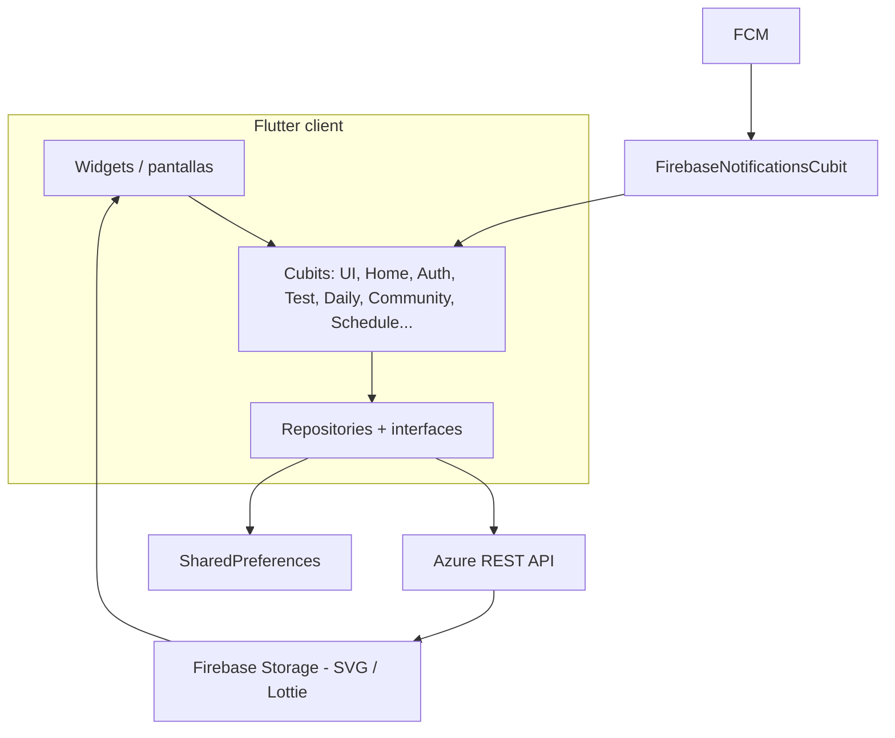

# Emotions & Care

**App Flutter de salud mental para estudiantes universitarios.** El bienestar se cuida como una planta: cada hábito —diario, cuestionario, cita o carta anónima— hace crecer un jardín personal, desbloquea recompensas y deja un rastro útil para el especialista.

Este repositorio es el **cliente móvil y web**. Habla con un backend REST en Azure y usa Firebase para push, assets y hosting.

<p align="center">
  
</p>

<table>
  <tr>
    <td align="center" valign="top" width="33%">
      
      <br><sub><b>Jardín</b> — planta, fase y stickers</sub>
    </td>
    <td align="center" valign="top" width="33%">
      
      <br><sub><b>Cuestionarios</b> — progreso 4 de 20</sub>
    </td>
    <td align="center" valign="top" width="33%">
      
      <br><sub><b>Colección</b> — flores, stickers, logros</sub>
    </td>
  </tr>
</table>

<table>
  <tr>
    <td align="center" valign="top" width="50%">
      
      <br><sub><b>Especialistas · Tests · Diario</b></sub>
    </td>
    <td align="center" valign="top" width="50%">
      
      <br><sub><b>Objetivos</b> — lo que hace crecer la planta</sub>
    </td>
  </tr>
</table>

---

## Por qué este proyecto importa (en 30 segundos)

El problema no era “hacer otra app de bienestar”. Era **sostener el hábito** en un dominio sensible, con **dos tipos de usuario** (estudiante y especialista) y un incentivo que no trivializara la salud mental.

La respuesta de producto es un **jardín gamificado dirigido por el backend**: la planta no sube de nivel porque el cliente lo decide. El servidor evalúa objetivos reales (`currentValue` vs `targetValue`). El cliente se encarga de que ese progreso se *sienta*: animación, cambio de SVG por etapa, stickers en el patio y una colección que se puede enseñar.

Si vas a leer una sola sección, lee [Cómo crece la planta](#cómo-crece-la-planta-el-sistema-que-vale-la-pena-discutir-en-entrevista).

---

## Qué hace la app

Un login, dos productos. `LoginStack` ramifica a `PattientStack` o `SpecialistStack` según el tipo de usuario.

### Estudiante (paciente)

| Superficie | Qué resuelve |
| --- | --- |
| **Jardín** | Home. Planta en maceta, fondo Lottie, avión de papel con notificaciones, stickers colocables. |
| **Cuestionarios** | Evaluaciones psicométricas, historial, cooldown de 15 días y gráficas de progreso. |
| **Diario** | Notas ligadas a emociones, visibilidad y vista de evolución. |
| **Comunidad** | Cartas anónimas (solo la inicial del emisor). Pedir y dar apoyo sin exponer identidad. |
| **Agenda** | Buscar especialista, vincularse y agendar citas. |
| **Colección** | Museo de stickers, flores y logros ganados. |
| **Configuración** | Perfil, tema, fondo, privacidad y términos. |

El onboarding es un flujo guiado (`register` → elegir planta → `registerSuccess`), no un dump de pantallas. El drawer anima el siguiente paso hasta completar el registro.

### Especialista

Tablero distinto: solicitudes de vinculación, citas pendientes, agenda, lista de pacientes (con su diario, tests y progreso) y la misma comunidad. El especialista **no cultiva un jardín**; ve el seguimiento clínico detrás del jardín del estudiante.

---

## Cómo crece la planta (el sistema que vale la pena discutir en entrevista)

La metáfora del producto es literal en código: *cuidar tu salud emocional = cuidar una planta*. El reto de ingeniería fue que esa metáfora **no mintiera**. Si el cliente incrementara el nivel a ciegas, el jardín se convertiría en un skin. Si todo viviera en el servidor sin feedback inmediato, se sentiría lento y opaco.

### Modelo: una flor no es un sprite, es una línea de tiempo visual

```
FlowerModel
  urls[]          → una imagen SVG por etapa (semilla → flor plena)
UserFlower
  state           → índice de etapa actual (0…6)
  position        → slot en el jardín (position == 2 → la que está en la maceta)
  createdAt       → cuándo se desbloqueó
```

La planta que ves no es un asset fijo. El widget pinta:

```dart
currentFlower.flower.urls[currentFlower.state].url
```

Subir de etapa es **cambiar de imagen**, no interpolar un mesh. Seis estados visuales, servidos desde Firebase Storage, fáciles de iterar con diseño sin tocar Flutter.

### El backend decide si puede crecer; el cliente decide cómo se siente

Los objetivos de la etapa actual llegan como `ProgressInfo`:

| Campo | Rol |
| --- | --- |
| `name` / `description` | Copy del objetivo (“escribe N notas”, “completa un test”) |
| `currentValue` / `targetValue` | Progreso medible, no un booleano mágico |
| `isCompleted` | Semáforo para la UI |

`GET Paciente/{id}/getStageProgress` hidrata `UICubit.flowerProgress`. Tocar la maceta **expande un panel de madera** (`PotWidget`) y muestra esas barras. El jardín es a la vez recompensa y tablero de misión.

Cuando el servidor considera que la etapa está lista:

1. Llega una notificación in-app (`NotificationType.growNotifications`) — el avión de papel del home.
2. Opcionalmente, un push FCM con módulo `yard` / evento `canGrow`.
3. El usuario pulsa **“Crecer mi planta”**.

Ahí parte el truco de UX:

```
tap "Crecer mi planta"
        │
        ├─► BegginCubit.status = growing
        │         └─► HomeScreen reproduce un flash
        │                   └─► UICubit.growFlowerStage()
        │                         state++  →  nuevo SVG (optimista)
        │
        └─► HomeCubit.growFlowerinBack()
                  POST Paciente/{id}/growStage
```

**Optimistic UI con coreografía.** El crecimiento se ve al instante (flash + cambio de etapa). La persistencia viaja en paralelo. El estado de crecimiento está acotado (`HomeStatus.growing`, `BegginStatus.growing`) para que la animación no se dispare dos veces ni se pierda si el usuario cambia de pantalla.

Tope de seguridad en cliente: no se ofrece el botón si `userFlower.state >= 5` (la última etapa es el destino, no un loop infinito).

### Layout del jardín: un Stack que sobrevive a teléfonos, minis y tablets

`calculatePlantAndPotPosition` no usa tamaños mágicos. Escala maceta, planta y offsets con el ancho:

- `< 400` → iPhone Mini / compactos
- `> 700` → tablets
- default → teléfonos

Los stickers ocupan **4 slots fijos** alrededor de la maceta. `UserSticker.position` (1-based, backend) se mapea a índice 0-3 en `UICubit.getStickersForUI`. Quitar un sticker deja un `StickerModel.empty()` en el hueco: la UI nunca “se colapsa”.

Personalización extra: tema claro/oscuro persistido en `SharedPreferences` **y** en el servidor (`themeId`, `backgroundUrl`), fondos Lottie (`Jardin` / `StaryBG`), y copy remoto (`AppText` desde `Texts/GET-ALL`) para no redeployar la app por un párrafo.

---

## Recompensas: stickers, flores y logros (no un contador de XP)

El jardín se alimenta de un **sistema de metas tipadas**. Un `GoalModel` puede nacer de:

| `GoalType` | Ejemplo de acción |
| --- | --- |
| `test` | Completar un cuestionario |
| `community` | Enviar o responder una carta |
| `specialist` | Vincularse o asistir a una cita |
| `recomendation` | Marcar una recomendación como hecha |

Cada meta puede otorgar `stickerId` y/o `flowerId`. El cliente no “suma puntos”: **recibe un objeto coleccionable**.

### Tres capas de recompensa

1. **Stickers** — llegan como `NotificationType.sticker` (título, descripción, URL SVG). “Recoger sticker” lo mete al inventario (`UICubit.addSticker`). Luego el usuario lo coloca en uno de los 4 huecos del jardín (`PUT .../putStickeriInInterface/{stickerId}/{index}`).
2. **Flores** — varias en colección, una activa en la maceta. Cambiar de planta es `setFlowerInInterface`. Cada flor guarda su propia etapa, así que coleccionar no resetea el progreso.
3. **Achievements** — `UserAchievement` con `progress`, `dateEarned` y un `progressMap`. `getAchivement` solo expone el logro si aún no tiene fecha de obtención: la UI de “recién desbloqueado” no se repite.

La **Colección** (`GoalsRoom`) es el inventario persistente: stickers con fecha, flores con barra `etapa / 6`, logros. El jardín es el showcase; la colección es la prueba.

Esto encaja con el dominio: celebrar el hábito (el sticker en el patio es un recordatorio visual) sin convertir la salud mental en un high-score público. Las cartas de comunidad siguen siendo anónimas.



---

## Arquitectura

Feature-first, tres capas por módulo: **data → domain → presentation**. Estado con **Cubit/BLoC**, inyección con **GetIt**, sesión y preferencias en **SharedPreferences**.



**Por qué Cubits y no un store global único.** Cada módulo posee su ciclo de vida (`clean()` al logout). `UICubit` es el único estado transversal del jardín (planta, stickers, tema, textos, progreso). `HomeCubit` habla de notificaciones y crecimiento. `BegginCubit` es sesión y onboarding. El flash de crecimiento es un *evento de estado* que cruza esos tres cubits a propósito: auth señala “está creciendo”, home persiste, UI pinta.

**Dos stacks, un service locator.** `setupServiceLocator()` registra repositorios y cubits una vez. `PattientStack` y `SpecialistStack` componen navegación distinta sobre las mismas dependencias. El especialista reutiliza diario, tests y comunidad en modo lectura/acompañamiento.

**Navegación.** `NavigationBloc` con `NavigateTo` — un enum, un `AnimatedSwitcher`. Sin router generado: suficiente para un producto con drawer + stacks, y fácil de seguir en code review.

### Mapa de carpetas

```
lib/
├── main.dart                 # Firebase + MultiBlocProvider + arranque
├── helpers/                  # DI, API, navegación, UICubit, FCM
│   ├── service_locator.dart
│   ├── api_client.dart       # base URL Azure
│   ├── ui_bloc.dart          # jardín, tema, stickers, progreso
│   ├── navigation_bloc.dart
│   └── notifications_cubit.dart
├── modules/
│   ├── auth_module/          # login dual, paciente, especialista, flores, stickers
│   ├── yard_module/          # jardín, maceta, colección, notificaciones de crecimiento
│   ├── diary_module/         # notas + emociones
│   ├── test_module/          # cuestionarios e historial
│   ├── community_module/     # cartas anónimas + goals
│   ├── schedule_module/      # citas (estudiante)
│   ├── dates_module/         # citas (especialista)
│   ├── patients_module/      # panel de pacientes
│   ├── patients_request/     # vinculación
│   └── settings_module/
├── widgets/                  # UI compartida (diálogos, stickers, headers)
├── config/assets/            # SVG, PNG, Lottie, tipografía Gilroy
└── utils_functions/
```

Cada módulo sigue el mismo contrato:

```
módulo/
├── data/          # HTTP + interfaces (testeable, intercambiable)
├── domain/        # modelos + fromJson/toJson/copyWith
└── presentation/
    ├── logic/     # Cubit + State (Equatable)
    └── ui/        # Controller (orquesta) + screens
```

Los *controllers* no son GetX: son widgets que cablean cubit + pantalla y el flujo de registro/validación. `helpers/paths.dart` es el barrel del proyecto.

---

## Stack (con el porqué)

| Pieza | Para qué está |
| --- | --- |
| **Flutter 3 / Dart 3.4** | Un codebase: Android, iOS y web (`Firebase Hosting` + `apphosting.yaml`). |
| **flutter_bloc + equatable** | Estados explícitos (`growing`, `loading`, `registerSuccess`) que la UI puede coreografiar. |
| **GetIt** | Composición de 12+ cubits sin Service Locator escondido en widgets. |
| **http** | Cliente REST contra Azure (`Api.baseUrl`). |
| **Firebase Core + Messaging** | Push por módulo (`yard`, `schedule`, `patientRequest`, `sync`). |
| **SharedPreferences** | Sesión “recordarme”, tema y fondo; el servidor sigue siendo la fuente de verdad del jardín. |
| **Lottie + flutter_svg + cached_network_image** | Jardín vivo: fondos animados, planta remota por etapa, stickers SVG. |
| **fl_chart + table_calendar** | Progreso de tests/diario y agenda clínica. |
| **card_swiper** | Cartas de comunidad. |
| **provider** | Punto de extensión; el estado de producto vive en Cubits. |

Backend: API .NET en Azure App Service. Assets de plantas/maceta en Firebase Storage. Hosting web en Firebase.

---

## Otras decisiones que suelen salir en entrevista

- **Onboarding como máquina de estados**, no como tutorial descartable. `registerPatientFlow` (`register` → personalizar planta → `registerSuccess`) bloquea módulos hasta que hay planta. El drawer resalta el siguiente paso.
- **Copy remoto.** `AppText` con `||` como separador de párrafos. Producto e investigación pueden cambiar textos sin store release.
- **Anonimato en comunidad.** `letraEmisor` + contenido. El modelo de carta no arrastra nombre ni foto.
- **Cooldown de cuestionarios (15 días).** Evita spam de tests y alinea el producto con uso clínico, no con grinding.
- **Optimistic UI en jardín y stickers.** La interfaz se actualiza *antes* del `PUT/POST`; el repositorio corre después. En un jardín que se “juega”, 300 ms de espera se sienten rotos.
- **Responsive artesanal del patio.** Un `Stack` con posiciones relativas al ancho, no un layout que se rompe en tablet.
- **Logout limpio.** Cada cubit implementa `clean()`; no hay estado de paciente residual en un especialista que comparte dispositivo.

---

## Cómo correrlo

```bash
flutter pub get
flutter run            # dispositivo / emulador
flutter run -d chrome  # web
```

Requisitos: Flutter SDK compatible con Dart `>=3.4.4 <4.0.0`, y la configuración Firebase que ya vive en el repo (`lib/firebase_options.dart`, `google-services.json`, `GoogleService-Info.plist`).

La API de desarrollo apunta a Azure (`helpers/api_client.dart`). Web se publica desde `build/web` vía `firebase.json`.

---

## Equipo

Proyecto de **Tech4Good Research Lab** (Dra. Karina Caro Corrales), con consultoría en salud mental y un equipo mixto de producto, diseño y desarrollo.

Este cliente Flutter es la cara del sistema: el jardín, los dos roles, la gamificación y la orquestación de estado. El backend (progreso de etapas, metas, notificaciones) es el árbitro.

---

## Licencia

Proyecto privado / no publicado en pub.dev (`publish_to: none`).
